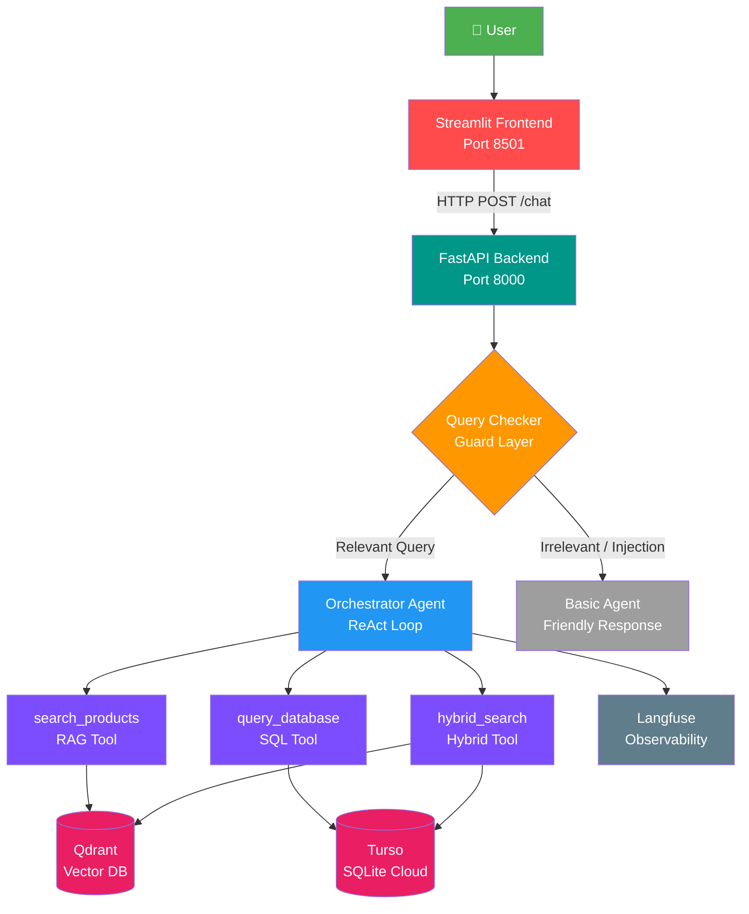
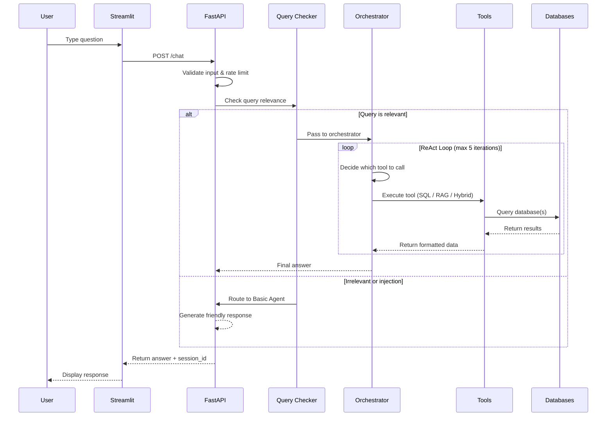

# 🛒 Olist E-commerce AI Assistant


---

## 🚀 Overview

**Olist E-commerce AI Assistant** is a multi-agent AI chatbot designed for exploring and analyzing the [Olist Brazilian E-commerce](https://www.kaggle.com/datasets/olistbr/brazilian-ecommerce) dataset. It combines **natural language to SQL** query generation, **semantic vector search** via Qdrant, and a **hybrid retrieval** strategy to provide comprehensive, data-driven answers about products, sellers, customers, orders, and reviews.

### Key Capabilities

- **Text-to-SQL**: Converts natural language questions into SQL queries and executes them against a Turso (libSQL) cloud database containing ~100K orders (2016–2018).
- **RAG (Retrieval-Augmented Generation)**: Performs semantic search over product reviews using OpenAI embeddings and Qdrant vector database.
- **Hybrid Search**: Combines SQL-based structured filtering with RAG semantic search for questions that require both data types.
- **Prompt Injection Detection**: Built-in guard layer that detects and blocks prompt injection attempts before they reach the agent.
- **Output Guardrails**: Query relevance checking ensures only e-commerce-related queries are processed by the full agent pipeline.
- **Observability**: Integrated Langfuse tracing for monitoring agent behavior, tool calls, and performance.

### Who Is This For?

Data analysts, product managers, and business stakeholders who want to explore Olist e-commerce data through a natural language conversational interface — no SQL knowledge required.

---

## 🏗️ Architecture



**Flow Summary:**

1. User sends a message via the Streamlit chat interface.
2. The Streamlit frontend forwards the message to the FastAPI backend (`POST /chat`).
3. The **Query Checker** (guard layer) evaluates whether the query is relevant to Olist e-commerce and screens for prompt injection.
4. If relevant → the **Orchestrator Agent** runs a ReAct loop (up to 5 iterations), selecting from three tools: `search_products`, `query_database`, or `hybrid_search`.
5. If irrelevant or injection detected → a **Basic Agent** provides a friendly, scoped response.
6. The final answer is returned to the user through the Streamlit UI.

---

## 🛠️ Tech Stack

| Layer            | Technology                                                        |
| ---------------- | ----------------------------------------------------------------- |
| **Backend API**  | FastAPI 0.115, Uvicorn, Python 3.12                               |
| **Frontend**     | Streamlit 1.39                                                    |
| **LLM**          | OpenAI GPT-4o-mini (general), GPT-5.4-mini (SQL generation)      |
| **Framework**    | LangChain 1.3, LangChain-OpenAI                                  |
| **Vector DB**    | Qdrant (cloud), OpenAI `text-embedding-3-small` embeddings        |
| **SQL Database** | Turso (libSQL cloud SQLite), SQLAlchemy, sqlalchemy-libsql        |
| **Observability**| Langfuse 4.11, OpenTelemetry LangChain Instrumentation            |
| **Validation**   | Pydantic 2.9                                                      |
| **Infra**        | Docker, Docker Compose, bridge network                            |

---

## 📁 Project Structure

```
project-root/
├── backend/                        # FastAPI backend service
│   ├── api/
│   │   └── main.py                 # FastAPI app, endpoints, rate limiter, CORS
│   ├── chatbot/
│   │   ├── agents/
│   │   │   └── orchestrator.py     # ReAct agent loop, session management, Langfuse tracing
│   │   ├── checker/
│   │   │   └── checker_output.py   # Query relevance validation & prompt injection detection
│   │   ├── prompt/
│   │   │   ├── guard_prompt.py     # System prompts for query checker & basic agent
│   │   │   ├── hybrid_prompt.py    # Prompts for hybrid SQL+RAG search
│   │   │   ├── orchestrator_prompt.py  # Orchestrator system prompt with tool routing rules
│   │   │   ├── rag_prompt.py       # RAG semantic search & translation prompts
│   │   │   └── sql_prompt.py       # Text-to-SQL prompt, DB schema, query examples
│   │   ├── tools/
│   │   │   └── tools.py            # Tool definitions: search_products, query_database, hybrid_search
│   │   └── config.py               # LLM instances, Qdrant client, SQLAlchemy engine
│   ├── Dockerfile                  # Backend container image (Python 3.12-slim)
│   ├── example.env                 # Example environment variable template
│   └── requirements.txt            # Backend Python dependencies
│
├── data/
│   ├── raw/                        # Original Olist dataset CSV files
│   ├── process/                    # Intermediate cleaned data files
│   └── final/                      # Processed datasets ready for DB ingestion
│
├── frontend/
│   ├── streamlit_app/
│   │   └── app.py                  # Streamlit chat UI with session management
│   ├── Dockerfile                  # Frontend container image (Python 3.12-slim)
│   └── requirements.txt            # Frontend Python dependencies
│
├── logs/                           # Application log files (auto-created at runtime)
│
├── utils/
│   ├── create_sql/
│   │   ├── create_schema.py        # SQLAlchemy ORM models for all 7 tables
│   │   └── create_sql.py           # Seed script: loads CSV data into SQL database
│   ├── feature_engineering/
│   │   ├── cleanup.py              # Unicode normalization & accent removal for location data
│   │   └── feature_engineering.py  # Feature engineering: volume, weight categories, delivery status
│   └── qdrant/
│       └── create_qdrant_databse.py  # Qdrant vector DB collection creation & document indexing
│
├── docker-compose.yml              # Multi-service orchestration (backend + frontend)
├── LICENSE                         # MIT License
└── README.md                       # This file
```

---

## ✅ Prerequisites

Before setting up the project, ensure the following are installed:

- **Python 3.12+**
- **Docker** & **Docker Compose** (for containerized deployment)
- **Git**

You will also need accounts and API keys for:

- **OpenAI** — for LLM inference and embeddings
- **Qdrant Cloud** — for the hosted vector database
- **Turso** — for the hosted libSQL (SQLite) cloud database
- **Langfuse** — for observability and tracing (optional but recommended)

---

## 🔐 Environment Variables

The application requires the following environment variables. Create a `.env.backend` file in the `backend/` directory and a `.env.frontend` file in the `frontend/` directory based on the templates below.

### Backend (`backend/.env.backend`)

| Variable               | Description                                         | Example                                  | Required |
| ---------------------- | --------------------------------------------------- | ---------------------------------------- | -------- |
| `OPENAI_API_KEY`       | OpenAI API key for GPT and embedding models         | `sk-proj-xxxxxxxxxxxx`                   | ✅       |
| `QDRANT_URL`           | Qdrant Cloud cluster URL                            | `https://xxx.us-east4-0.gcp.cloud.qdrant.io:6333` | ✅       |
| `QDRANT_API`           | Qdrant Cloud API key                                | `qdrant-api-key-here`                    | ✅       |
| `QDRANT_COLLECTION`    | Qdrant collection name (defaults to `olist_data_3`) | `olist_data_3`                           | ❌       |
| `TURSO_DATABASE_URL`   | Turso libSQL database URL                           | `libsql://your-db-name.turso.io`         | ✅       |
| `TURSO_DATABASE_TOKEN` | Turso authentication token                          | `eyJhbGciOiJFZ...`                       | ✅       |
| `LANGFUSE_SECRET_KEY`  | Langfuse secret key for tracing                     | `sk-lf-xxxxxxxxxxxx`                     | ✅       |
| `LANGFUSE_PUBLIC_KEY`  | Langfuse public key for tracing                     | `pk-lf-xxxxxxxxxxxx`                     | ✅       |
| `LANGFUSE_HOST`        | Langfuse host URL                                   | `https://cloud.langfuse.com`             | ✅       |

### Frontend (`frontend/.env.frontend`)

| Variable   | Description                              | Example                  | Required |
| ---------- | ---------------------------------------- | ------------------------ | -------- |
| `API_URL`  | Backend API base URL                     | `http://backend:8000`    | ✅       |

---

## ⚙️ Installation & Setup

### Option A: Docker (Recommended)

```bash
# Clone the repository
git clone https://github.com/Purwadhika-AI-Engineering/Repo-Final-Project-Kelompok-3.git
cd Repo-Final-Project-Kelompok-3

# Create environment files
cp backend/example.env backend/.env.backend
# Edit backend/.env.backend with your API keys and database credentials

# Create frontend env file
echo "API_URL=http://backend:8000" > frontend/.env.frontend

# Build and run all services
docker-compose up --build
```

Once running:
- **Frontend (Streamlit)**: [http://localhost:8501](http://localhost:8501)
- **Backend API docs**: [http://localhost:8000/docs](http://localhost:8000/docs)

### Option B: Manual Setup

#### Backend

```bash
cd backend
python -m venv venv
source venv/bin/activate  # Windows: venv\Scripts\activate
pip install -r requirements.txt

# Set environment variables
cp example.env .env.backend
# Edit .env.backend with your values

# Run the API server
uvicorn api.main:app --reload --host 0.0.0.0 --port 8000
```

#### Frontend

```bash
cd frontend/streamlit_app
python -m venv venv
source venv/bin/activate
pip install -r ../requirements.txt

# Set the API URL
export API_URL=http://localhost:8000

# Run Streamlit
streamlit run app.py
```

---

## 🗄️ Database Setup

### SQL Database (Turso)

The project uses **Turso** (libSQL cloud) as its SQL database. To set up the schema and seed data:

```bash
cd utils/create_sql
python create_schema.py   # Define ORM models and create table schema
python create_sql.py       # Populate tables with processed Olist data
```

**Database Tables:**
| Table         | Description                                          |
| ------------- | ---------------------------------------------------- |
| `customers`   | Customer IDs, cities, and states                     |
| `product`     | Product details, categories, dimensions, weight      |
| `seller`      | Seller IDs, locations                                |
| `orders`      | Order metadata, timestamps, delivery status          |
| `payments`    | Payment types, installments, values                  |
| `order_items` | Line items linking orders, products, sellers, prices |
| `review`      | Review scores linked to orders                       |

### Qdrant Vector Database

The Qdrant collection stores product review embeddings for semantic search:

```bash
cd utils/qdrant
python create_qdrant_databse.py
```

This script:
1. Merges review, order item, and product data
2. Creates `Document` objects with review text as content and product category/score as metadata
3. Generates embeddings using OpenAI `text-embedding-3-small`
4. Uploads documents to the specified Qdrant collection

---

## 🔄 Data Pipeline

The data processing pipeline transforms raw Olist CSV files into database-ready datasets:

```
data/raw/                          data/process/                      data/final/
├── olist_customers_dataset.csv     ├── olist_customer_dataset_clean   ├── olist_customer_dataset_final
├── olist_sellers_dataset.csv   ──► ├── olist_sellers_dataset_clean ──►├── olist_sellers_dataset_final
├── olist_products_dataset.csv      ├── olist_product_dataset_clean    ├── olist_product_dataset_final
├── olist_orders_dataset.csv        └── olist_geolocation_dataset_clean├── olist_orders_dataset_final
├── olist_order_items_dataset.csv                                      ├── olist_order_items_dataset_final
├── olist_order_payments_dataset.csv                                   └── olist_order_payments_dataset_final
└── olist_geolocation_dataset.csv
```

**Pipeline Steps:**

1. **`cleanup.py`** — Unicode normalization and accent removal (e.g., "São Paulo" → "sao paulo") for location fields across customer, seller, product, and geolocation datasets.
2. **`feature_engineering.py`** — Feature creation and enrichment:
   - Fixes location names using geolocation ZIP code mapping
   - Translates product category names from Portuguese to English
   - Calculates `product_volume` (length × height × width)
   - Creates `weight_category` (light / medium / heavy / very heavy)
   - Computes `status_delivered` (on time / late / not arrived)
   - Creates `order_category_status` (success / in progress / failed)
   - Calculates `total_price` (price + freight)
   - Creates `shipping_category` (free / cheap / standard / expensive / very expensive)
   - Generates unique UUIDs for `order_item_id` and `payment_id`

---

## 💬 Usage

### Accessing the Chat Interface

1. Open **Streamlit UI** at [http://localhost:8501](http://localhost:8501)
2. The sidebar shows API connection status, dataset info, and agent capabilities
3. Use the suggested question pills or type your own question in the chat input

### Example Queries

| Query Type | Example |
| ---------- | ------- |
| **SQL**    | "Kategori produk apa yang paling banyak ordernya?" |
| **SQL**    | "Berapa rata-rata harga produk elektronik?" |
| **SQL**    | "Seller mana yang punya revenue tertinggi?" |
| **RAG**    | "Rekomendasi kategori produk peralatan dapur" |
| **RAG**    | "Produk apa yang review-nya paling bagus?" |
| **Hybrid** | "Ada produk dari seller di São Paulo yang review-nya bagus?" |

### Accessing the API Directly

- **Swagger UI**: [http://localhost:8000/docs](http://localhost:8000/docs)
- **Health Check**: `GET http://localhost:8000/health`

---

## 📡 API Reference

### `GET /health`

Health check endpoint.

**Response:**
```json
{
  "status": "ok",
  "service": "Olist AI Assistant"
}
```

---

### `POST /chat`

Main chat endpoint. Sends a user message to the AI agent and returns the response.

**Request Body:**
```json
{
  "message": "Kategori produk apa yang paling banyak ordernya?",
  "session_id": "550e8400-e29b-41d4-a716-446655440000"  // optional, UUID format
}
```

| Field        | Type     | Required | Description                                                      |
| ------------ | -------- | -------- | ---------------------------------------------------------------- |
| `message`    | `string` | ✅       | User message (max 500 characters)                                |
| `session_id` | `string` | ❌       | UUID session ID. Auto-generated if not provided.                 |

**Response:**
```json
{
  "answer": "Berikut top 10 kategori produk berdasarkan jumlah order...",
  "session_id": "550e8400-e29b-41d4-a716-446655440000"
}
```

**Error Responses:**

| Status | Description                                    |
| ------ | ---------------------------------------------- |
| `422`  | Validation error (empty message, too long, invalid UUID) |
| `429`  | Rate limit exceeded (max 20 requests/minute per session) |
| `500`  | Internal server error                          |

---

### `DELETE /session/{session_id}`

Clears the conversation history for a given session.

**Path Parameter:**
- `session_id` — UUID of the session to delete

**Response:**
```json
{
  "status": "deleted",
  "session_id": "550e8400-e29b-41d4-a716-446655440000"
}
```

---

## 🤖 How the Chatbot Works



### Detailed Flow

1. **Input Validation** — FastAPI validates message length (≤500 chars), checks session UUID format, and enforces rate limiting (20 req/min per session).

2. **Query Checker (Guard Layer)** — An LLM with structured output (`ChekerOutput`) evaluates whether the query is:
   - ✅ Relevant to Olist e-commerce (products, orders, sellers, reviews, statistics)
   - ❌ A greeting, off-topic question, or prompt injection attempt

3. **Orchestrator Agent (ReAct Loop)** — If relevant, the orchestrator runs a ReAct (Reason + Act) loop for up to 5 iterations:
   - Analyzes the user's intent using the system prompt
   - Selects the appropriate tool(s): `search_products` (RAG), `query_database` (SQL), or `hybrid_search`
   - Executes the tool and incorporates results
   - Generates the final answer in the user's language

4. **Basic Agent** — If irrelevant or injection is detected, a simpler agent provides a polite, scoped response about Olist services.

5. **Session Management** — Conversation history is maintained in-memory with a sliding window of the last 10 messages (WINDOW_K = 10) per session.

---

## 🧪 Development

### Running Tests

```bash
# Navigate to the backend directory
cd backend

# Run tests (if pytest is configured)
pytest
```

### Logs

Application logs are written to the `logs/` directory (created automatically at runtime). The backend uses Python's `logging` module with `INFO` level and outputs to both `StreamHandler` (console) and log files.

```
logs/   ← Application logs are written here at runtime
```

---

## 🐳 Docker Services

The `docker-compose.yml` defines two services connected via a bridge network:

| Service      | Image            | Port Mapping   | Description                                | Health Check              |
| ------------ | ---------------- | -------------- | ------------------------------------------ | ------------------------- |
| `backend`    | `backend:1.0`    | `8000:8000`    | FastAPI API server (Uvicorn)               | `curl http://localhost:8000/health` (10s interval) |
| `frontend`   | `frontend:1.0`   | `8501:8501`    | Streamlit chat interface                   | —                         |

**Network:** Both services share the `app-network` (bridge driver) for internal communication. The frontend connects to the backend via `http://backend:8000`.

---

## 🔧 Troubleshooting

| Issue                             | Solution                                                                                              |
| --------------------------------- | ----------------------------------------------------------------------------------------------------- |
| **Qdrant connection errors**      | Verify `QDRANT_URL` and `QDRANT_API` in `.env.backend`. Check that the Qdrant Cloud cluster is running. |
| **SQL database not found**        | Verify `TURSO_DATABASE_URL` and `TURSO_DATABASE_TOKEN`. Ensure the Turso database has been seeded.     |
| **Missing environment variables** | Ensure both `.env.backend` and `.env.frontend` files exist and contain all required variables.          |
| **Port conflicts**                | Change port mappings in `docker-compose.yml` if ports 8000 or 8501 are already in use.                 |
| **Rate limit exceeded (429)**     | Wait 60 seconds. The limit is 20 requests per minute per session.                                      |
| **API Disconnected in Streamlit** | Click "🔄 Check API Status" in the sidebar. Ensure the backend container is running and healthy.        |
| **Request timeout**               | The agent may take time to process complex queries. The default timeout is 60 seconds.                  |
| **OpenAI API errors**             | Verify `OPENAI_API_KEY` is valid and has sufficient quota.                                             |

---

## 🤝 Contributing

Contributions are welcome! To contribute:

1. **Fork** the repository
2. **Create** a feature branch (`git checkout -b feature/your-feature`)
3. **Commit** your changes (`git commit -m 'Add your feature'`)
4. **Push** to the branch (`git push origin feature/your-feature`)
5. **Open** a Pull Request

Please ensure your code follows the existing project structure and includes appropriate documentation.

---

## 📄 License

This project is licensed under the **MIT License** — see the [LICENSE](LICENSE) file for details.

Copyright (c) 2026 Purwadhika AI Engineering
